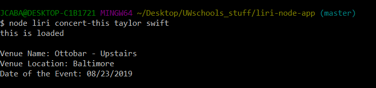

# liri-node-app

## About

LIRI is like iPhone's SIRI. However, while SIRI is a Speech Interpretation and Recognition Interface, LIRI is a _Language_ Interpretation and Recognition Interface. LIRI will be a command line node app that takes in parameters and gives you back data.

### Setup the application

1. Download or clone the repository
2. In your preferred terminal application do the following:
3. npm install the following packages:
  1. Node-Spotify-API
  2. Axios
  3. Moment
  4. DotEnv

4. Create a .env file in the same directory as the rest of the files. In the .env file should be:

'# Spotify API keys'

'SPOTIFY_ID=your-spotify-ID-here'

'SPOTIFY_SECRET=your-spotify-secret-here'

### How to use

The user will have four commands
* concert-this
* spotify-this-song
* movie-this
* do-what-it-says

Entering: node liri.js concert-this 'concert or band name' 

This will show the following information about each event in your terminal/bash window:

Name of the Venue

Location of the Venue

Date of the Event

Example:
;

