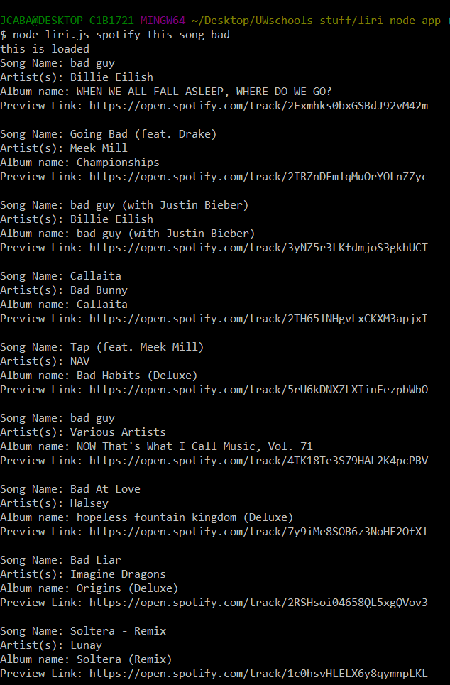
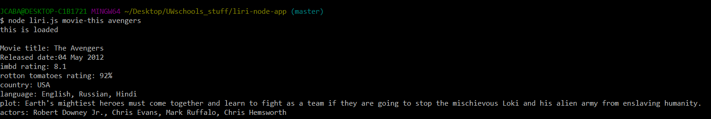
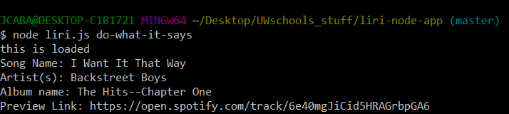

# liri-node-app

## About

LIRI is like iPhone's SIRI. However, while SIRI is a Speech Interpretation and Recognition Interface, LIRI is a _Language_ Interpretation and Recognition Interface. LIRI will be a command line node app that takes in parameters and gives you back data.

### Setup the application

1. Download or clone the repository
2. In your preferred terminal application do the following:
3. npm install the following packages:
  1. Node-Spotify-API
  2. Axios
  3. Moment
  4. DotEnv

4. Create a .env file in the same directory as the rest of the files. In the .env file should be:

'# Spotify API keys'

'SPOTIFY_ID=your-spotify-ID-here'

'SPOTIFY_SECRET=your-spotify-secret-here'

### How to use

The user will have four commands
* concert-this
* spotify-this-song
* movie-this
* do-what-it-says

#### Concert

Entering: node liri.js concert-this 'artist name' in your terminal

The following information about each event will display in your terminal/bash window:

Name of the Venue

Location of the Venue

Date of the Event

Example:
;

#### spotify-this-song

Entering: node liri.js spotify-this-song 'song name' in your terminal

If no song name is entered the song name will default into "The Sign"

The following information about the song will display in your terminal/bash window:
(A default of 10 songs will display based on your search)

Artist(s)

Song Name

Album of the Song

Spotify Song Preview Link

example:
;

#### movie-this

Entering: node liri.js movie-this 'movie name' in your terminal

if no movie name is entered then Mr.Nobody will default into the movie name

The following information about the movie will display in your terminal/bash window:

Title of the Movie

Year the Movie was Released

The IMDB Rating

Country the Movie was made in

Language the Movie is in

Plot of the Movie

Actors in the Movie

The Rotten Tomatoes Rating

example:
;

#### do-what-it-says

Entering: node liri.js do-what-it-says in your terminal

The program will read the random.txt file and follow the command inside

example:
;

